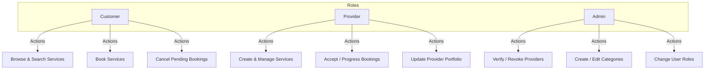
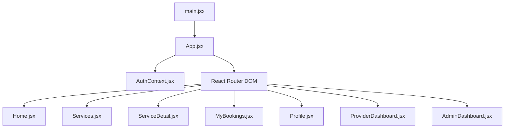

# ServeNear Project Technical Report & Documentation

This document provides a comprehensive, step-by-step developer report on the **ServeNear** local services marketplace project. It details the system architecture, database models, controllers, middleware, and user interface workflows, highlighting what each file does, how its content works, and how the three account types interact.

---

## 1. The Three Types of Accounts

The platform contains three main account roles defined by the `role` enum in the database schema: `customer`, `provider`, and `admin`.



### Customer Account
*   **Purpose**: Represents general users looking to hire professionals for local services.
*   **Core Capabilities**:
    *   Browse verified services and filter by category, city, price range, and sort preferences.
    *   Create service bookings for a chosen date, time slot, address, and notes.
    *   View their booking history in a dedicated tabbed interface.
    *   Cancel booking requests while they are in the `pending` state.
    *   Manage their personal profile details (name, phone, city).

### Provider Account (Service Provider)
*   **Purpose**: Represents professionals offering their skills (e.g. electricians, plumbers, tutors).
*   **Core Capabilities**:
    *   Register with specialized portfolio details (specialty category, years of experience, hourly rate, skills, bio).
    *   Access a provider-specific dashboard showing key metrics: *My Services*, *Pending Requests*, *Active Jobs*, and *Completed Jobs*.
    *   Create, edit, and delete services they offer.
    *   Manage customer bookings via state transitions (`pending` &rarr; `accepted` &rarr; `in-progress` &rarr; `completed`, or decline requests using `cancelled`).
    *   Update their provider portfolio details anytime.
*   **Verification Constraint**: Services offered by providers are hidden from search pages until an administrator manually verifies their account.

### Admin Account (Platform Administrator)
*   **Purpose**: Represents platform operators who moderate users, verify providers, and manage taxonomy.
*   **Core Capabilities**:
    *   Access the administrative dashboard showing platform stats, monthly booking metrics, and revenue figures.
    *   Moderate all platform users and modify their roles (promote/demote accounts to `customer`, `provider`, or `admin`).
    *   Verify or revoke verification statuses for service providers.
    *   Create, update, and delete service categories with customizable titles, descriptions, and emojis.

---

## 2. Server Architecture & File Breakdown

The server runs on **Node.js** and **Express**, using **MongoDB** via Mongoose for persistent data storage.

### Root Files
*   [package.json](file:///c:/Users/Hp/Downloads/project%20ground/server/package.json): Defines backend metadata, dependencies (`express`, `mongoose`, `bcryptjs`, `jsonwebtoken`, `express-validator`), and lifecycle scripts (`npm run dev` to start the app, `npm run seed` to populate reference data).
*   [.env](file:///c:/Users/Hp/Downloads/project%20ground/server/.env): Contains local environment variables, including the running `PORT`, MongoDB connection string (`MONGODB_URI`), and JSON Web Token security config (`JWT_SECRET`, `JWT_EXPIRE`).
*   [server.js](file:///c:/Users/Hp/Downloads/project%20ground/server/server.js): The entry point of the server. It:
    1. Loads environment variables and connects to MongoDB.
    2. Enables CORS middleware configured specifically for the Vite client origin.
    3. Mounts global JSON and URL-encoded parsers.
    4. Registers API route groups at `/api/auth`, `/api/services`, `/api/bookings`, `/api/categories`, `/api/admin`, and `/api/users`.
    5. Exposes a `/api/health` endpoint and hooks fallback handlers for `404 Not Found` routes and unhandled runtime exceptions.

### Config Folder
*   [db.js](file:///c:/Users/Hp/Downloads/project%20ground/server/config/db.js): Exports a helper function `connectDB` that establishes a connection using Mongoose, displaying connection hosts on success and terminating the process on error.

### Models Folder (Database Schemas)
*   [User.js](file:///c:/Users/Hp/Downloads/project%20ground/server/models/User.js):
    *   Defines attributes for core account credentials: name, email (validated via regex), password (hidden from query results by default), role, phone, city, and avatar.
    *   Features a sub-document schema `providerInfo` consisting of skills, bio, experience years, hourly rate, rating, total reviews, category reference, and verification status.
    *   Configures a pre-save hook to hash passwords using `bcryptjs` and methods to compare password attempts.
*   [Category.js](file:///c:/Users/Hp/Downloads/project%20ground/server/models/Category.js):
    *   Holds the category schema for taxonomies (e.g. Electrician, Tutor).
    *   Contains fields for name (unique, trimmed), icon (emoji character), description, and active state.
*   [Service.js](file:///c:/Users/Hp/Downloads/project%20ground/server/models/Service.js):
    *   Defines services created by providers.
    *   References `User` (provider) and `Category`.
    *   Stores title, description, price, pricing model (fixed vs. hourly), city, target coverage areas, and active status.
    *   Sets up index definitions for full-text search on titles and descriptions.
*   [Booking.js](file:///c:/Users/Hp/Downloads/project%20ground/server/models/Booking.js):
    *   Tracks transactions between customers and providers.
    *   References `User` (customer and provider refs) and `Service`.
    *   Maintains appointment particulars: date, time slot, delivery address, city, user notes, total price, and status (enum: `pending`, `accepted`, `in-progress`, `completed`, `cancelled`).

### Middleware Folder
*   [auth.js](file:///c:/Users/Hp/Downloads/project%20ground/server/middleware/auth.js): Custom authentication middleware. Extracts the token from the request header, decodes it using the JWT secret, fetches the associated user object, and attaches it as `req.user`. Returns structured error responses for missing, expired, or invalid tokens.
*   [roleCheck.js](file:///c:/Users/Hp/Downloads/project%20ground/server/middleware/roleCheck.js): Custom authorization middleware. Checks if `req.user.role` matches the roles permitted for the route. Returns `403 Forbidden` if unauthorized.

### Controllers Folder (API Logic)
*   [authController.js](file:///c:/Users/Hp/Downloads/project%20ground/server/controllers/authController.js):
    *   `register`: Registers a customer or provider, checking for email duplicates and validating inputs. Computes default ratings and sets provider verification to false.
    *   `login`: Verifies user passwords and returns a signed JWT token along with sanitized user info.
    *   `getMe`: Fetches the authenticated user profile, populating provider categories.
    *   `updateMe`: Modifies allowed profile and provider portfolio details, returning the updated document.
*   [adminController.js](file:///c:/Users/Hp/Downloads/project%20ground/server/controllers/adminController.js):
    *   `getStats`: Computes counts of users, services, categories, and bookings. Uses Mongo aggregations to sum completed booking revenues and group bookings by year/month for chart rendering.
    *   `getProviders`: Paginated search for service providers filtered by verification status.
    *   `verifyProvider`: Verifies or revokes provider accounts by modifying `providerInfo.isVerified`.
    *   `getUsers`: Paginated list of users supporting keyword search and role filters.
    *   `updateUser`: Modifies database properties (such as roles) for individual users.
*   [categoryController.js](file:///c:/Users/Hp/Downloads/project%20ground/server/controllers/categoryController.js):
    *   Exposes endpoints to list all active categories and fetch single documents.
    *   Exposes create, update, and delete actions restricted to admin users.
*   [serviceController.js](file:///c:/Users/Hp/Downloads/project%20ground/server/controllers/serviceController.js):
    *   `getServices`: Queries the catalog using filters for category, city, pricing, and keyword search. Sorts services by date, price, or rating. Filters results to only show services from verified providers.
    *   `getService`: Retrieves service details, populating owner information.
    *   `createService` / `updateService` / `deleteService`: Validates ownership permissions and performs corresponding database writes for providers.
    *   `getMyServices`: Returns a list of services owned by the authenticated provider.
*   [bookingController.js](file:///c:/Users/Hp/Downloads/project%20ground/server/controllers/bookingController.js):
    *   `createBooking`: Allows customers to book services, preventing booking self-owned listings.
    *   `getMyBookings`: Queries bookings depending on user role (customers see bookings they placed, providers see incoming requests, admins see everything).
    *   `updateBookingStatus`: Executes booking state transitions, validating that transitions follow a strict logic workflow:
        *   `pending` &rarr; `accepted` or `cancelled`
        *   `accepted` &rarr; `in-progress` or `cancelled`
        *   `in-progress` &rarr; `completed` or `cancelled`
        *   Restricts cancellation rights (customers can only cancel bookings in `pending`).
*   [userController.js](file:///c:/Users/Hp/Downloads/project%20ground/server/controllers/userController.js):
    *   `getUserProfile`: Exposes public profile information for a provider or user (excluding password data).

### Routes Folder
The route files map HTTP requests to corresponding controller methods and enforce security middlewares:
*   [auth.js](file:///c:/Users/Hp/Downloads/project%20ground/server/routes/auth.js): Maps authentication endpoints and mounts validations for registration/login bodies.
*   [admin.js](file:///c:/Users/Hp/Downloads/project%20ground/server/routes/admin.js): Configures administrative endpoints, securing all paths with `auth` and `roleCheck('admin')`.
*   [bookings.js](file:///c:/Users/Hp/Downloads/project%20ground/server/routes/bookings.js): Registers booking routes. Creates bookings for customers and status updates for customer/provider roles.
*   [categories.js](file:///c:/Users/Hp/Downloads/project%20ground/server/routes/categories.js): Registers public categories retrieval paths alongside protected admin management endpoints.
*   [services.js](file:///c:/Users/Hp/Downloads/project%20ground/server/routes/services.js): Configures public marketplace exploration and protected provider-only publishing routes.
*   [users.js](file:///c:/Users/Hp/Downloads/project%20ground/server/routes/users.js): Maps profile retrieval routes.

### Utils Folder
*   [seedData.js](file:///c:/Users/Hp/Downloads/project%20ground/server/utils/seedData.js): A database population utility. Connects to MongoDB, inserts the initial set of 10 standard category documents (Electrician, Plumber, etc.) if they do not exist, and seeds a default administrator account (`admin@servenear.com` / `admin123`).

---

## 3. Client Architecture & File Breakdown

The client is a single-page application built on **React** using **Vite** as a development server and bundler.



### Root Files
*   [package.json](file:///c:/Users/Hp/Downloads/project%20ground/client/package.json): Details frontend metadata, commands (`npm run dev`), React dependencies, routing modules, charting packages (`chart.js`, `react-chartjs-2`), icon sets (`react-icons`), toast alerts (`react-toastify`), and build configurations.
*   [index.html](file:///c:/Users/Hp/Downloads/project%20ground/client/index.html): HTML container rendering a root `div` where Vite mounts the React DOM structure. Includes Google Fonts imports for the typography system.
*   [vite.config.js](file:///c:/Users/Hp/Downloads/project%20ground/client/vite.config.js): Customizes compilation configs for Vite's compiler environment.

### Src Folder (Core React Logic)
*   [main.jsx](file:///c:/Users/Hp/Downloads/project%20ground/client/src/main.jsx): Entry script loading global CSS styles, initializing React, and mounting the `<App />` layout tree under `<StrictMode>`.
*   [App.css](file:///c:/Users/Hp/Downloads/project%20ground/client/src/App.css): Houses layout configurations, such as scroll margins, spacing structures, and animations.
*   [index.css](file:///c:/Users/Hp/Downloads/project%20ground/client/src/index.css): The application's design system style guide. Declares color variables, font tokens, margins, border radii, shadows, animations (fade, slide, scale, pulse, float), custom scrollbars, glassmorphism utilities, and reusable form elements.
*   [App.jsx](file:///c:/Users/Hp/Downloads/project%20ground/client/src/App.jsx): The application layout wrapper. Manages client routing, imports page components, embeds global navbar/footer containers, injects `ToastContainer` for user alerts, and wraps everything within the global authentication context provider.

### Context Folder
*   [AuthContext.jsx](file:///c:/Users/Hp/Downloads/project%20ground/client/src/context/AuthContext.jsx):
    *   Implements the global React authentication context state.
    *   Tracks logged-in user details (`user`), JWT storage credentials (`token`), and bootstrap status (`loading`).
    *   Queries user credentials from `/auth/me` on startup.
    *   Exposes `login`, `register`, `logout`, and profile update handles to child nodes.
    *   Provides convenience flags: `isAuthenticated`, `isAdmin`, `isProvider`, and `isCustomer`.

### Utils Folder
*   [api.js](file:///c:/Users/Hp/Downloads/project%20ground/client/src/utils/api.js):
    *   Configures an Axios client with a base API url (`http://localhost:5000/api`).
    *   Configures a request interceptor to automatically fetch and attach bearer token credentials from localStorage on outgoing requests.
    *   Configures a response interceptor to handle authentication failures by wiping local storage and redirecting unauthorized requests to the login screen.

### Components Folder (Reusable Views)
*   [ProtectedRoute.jsx](file:///c:/Users/Hp/Downloads/project%20ground/client/src/components/ProtectedRoute.jsx): Guard component that intercepts navigation. Shows loading spinners while validating session contexts, redirects guests to `/login`, and redirects users to `/` if they lack the required role.
*   [Navbar.jsx](file:///c:/Users/Hp/Downloads/project%20ground/client/src/components/Navbar.jsx) / [Navbar.css](file:///c:/Users/Hp/Downloads/project%20ground/client/src/components/Navbar.css):
    *   Main navigation bar. Renders brand logos and links.
    *   Displays contextual action buttons based on auth state (e.g. login links vs. profile menus).
    *   Displays a customized dropdown containing options corresponding to the user's role (Profile, Bookings, Dashboard, Admin Panel).
*   [Footer.jsx](file:///c:/Users/Hp/Downloads/project%20ground/client/src/components/Footer.jsx) / [Footer.css](file:///c:/Users/Hp/Downloads/project%20ground/client/src/components/Footer.css): Common footer displaying social profiles, category search links, and contacts.
*   [Loader.jsx](file:///c:/Users/Hp/Downloads/project%20ground/client/src/components/Loader.jsx) / [Loader.css](file:///c:/Users/Hp/Downloads/project%20ground/client/src/components/Loader.css): A loading animation showing nested rings spinning in opposite directions.
*   [ServiceCard.jsx](file:///c:/Users/Hp/Downloads/project%20ground/client/src/components/ServiceCard.jsx) / [ServiceCard.css](file:///c:/Users/Hp/Downloads/project%20ground/client/src/components/ServiceCard.css): Card listing service details, highlighting price options, category classifications, and provider credentials (avatars, verification stars, ratings).
*   [StarRating.jsx](file:///c:/Users/Hp/Downloads/project%20ground/client/src/components/StarRating.jsx): Generates star displays for ratings using icons from `react-icons`. Renders full and half-filled stars based on user scores.
*   [BookingModal.jsx](file:///c:/Users/Hp/Downloads/project%20ground/client/src/components/BookingModal.jsx) / [BookingModal.css](file:///c:/Users/Hp/Downloads/project%20ground/client/src/components/BookingModal.css): Modal for creating service bookings. Includes inputs for dates, times, addresses, and cities. Prevents booking prior to current dates using time calculations.
*   [SearchFilters.jsx](file:///c:/Users/Hp/Downloads/project%20ground/client/src/components/SearchFilters.jsx) / [SearchFilters.css](file:///c:/Users/Hp/Downloads/project%20ground/client/src/components/SearchFilters.css): A search control bar. Features input filters for keyword match, city searches, and category selectors, and includes expandable inputs for price ranges and sorting rules.

### Pages Folder (Routing Views)
*   [Home.jsx](file:///c:/Users/Hp/Downloads/project%20ground/client/src/pages/Home.jsx) / [Home.css](file:///c:/Users/Hp/Downloads/project%20ground/client/src/pages/Home.css):
    *   The landing page of the application.
    *   Features a hero section with custom background decorations, statistics, and a search input linked to the services catalog page.
    *   Displays active categories fetched from the backend.
    *   Displays informational graphics detailing the booking workflow.
*   [Login.jsx](file:///c:/Users/Hp/Downloads/project%20ground/client/src/pages/Login.jsx) / [Auth.css](file:///c:/Users/Hp/Downloads/project%20ground/client/src/pages/Auth.css):
    *   Captures user credentials (email, password) and calls the login service.
    *   Redirects successful authentications based on user roles (`admin` goes to `/admin`, `provider` goes to `/provider/dashboard`, `customer` goes to `/`).
*   [Register.jsx](file:///c:/Users/Hp/Downloads/project%20ground/client/src/pages/Register.jsx):
    *   Handles account registration with role-based input toggling.
    *   If the user selects the `provider` role, the form dynamically displays input fields for category, experience, hourly rate, skills list, and bio.
*   [Services.jsx](file:///c:/Users/Hp/Downloads/project%20ground/client/src/pages/Services.jsx) / [Services.css](file:///c:/Users/Hp/Downloads/project%20ground/client/src/pages/Services.css):
    *   Renders the marketplace search layout.
    *   Initializes search queries using parameters parsed from URLs, updates listing tables dynamically using filter inputs, and renders result grids with pagination.
*   [ServiceDetail.jsx](file:///c:/Users/Hp/Downloads/project%20ground/client/src/pages/ServiceDetail.jsx) / [ServiceDetail.css](file:///c:/Users/Hp/Downloads/project%20ground/client/src/pages/ServiceDetail.css):
    *   Shows detailed information for selected services, category badges, prices, and coverage maps.
    *   Displays provider portfolios, reviews, star ratings, experience summaries, and contact buttons.
    *   Opens booking modals for authenticated customers.
*   [MyBookings.jsx](file:///c:/Users/Hp/Downloads/project%20ground/client/src/pages/MyBookings.jsx) / [Dashboard.css](file:///c:/Users/Hp/Downloads/project%20ground/client/src/pages/Dashboard.css):
    *   Renders tabbed transaction registers showing booking data (dates, times, service descriptions, pricing, and contact profiles).
    *   Enables status filters (All, Pending, Accepted, In-Progress, Completed, Cancelled).
    *   Renders contextual action buttons based on user role to change booking statuses.
*   [Profile.jsx](file:///c:/Users/Hp/Downloads/project%20ground/client/src/pages/Profile.jsx):
    *   Renders forms for updating personal profile details.
    *   Enables editing specialized portfolio details (bio, experience, skills) for providers.
*   [ProviderDashboard.jsx](file:///c:/Users/Hp/Downloads/project%20ground/client/src/pages/ProviderDashboard.jsx):
    *   Provides management tools for service providers.
    *   Renders indicator cards summarizing listings count, pending bookings, active jobs, and completed works.
    *   Renders incoming booking requests with accept/decline action buttons.
    *   Renders a catalog grid of services managed by the provider, containing creation/edit forms and delete actions.
*   [AdminDashboard.jsx](file:///c:/Users/Hp/Downloads/project%20ground/client/src/pages/AdminDashboard.jsx):
    *   Administrative dashboard.
    *   Displays platform indicators (total users, verified providers, total services, bookings count, revenues, pending requests).
    *   Renders data charts using `react-chartjs-2`: a bar chart showing monthly booking counts and a doughnut chart showing booking status distributions.
    *   Lists recent bookings across the platform.
*   [AdminProviders.jsx](file:///c:/Users/Hp/Downloads/project%20ground/client/src/pages/AdminProviders.jsx): Displays tables of registered providers, supporting verification toggles (Verify/Revoke).
*   [AdminCategories.jsx](file:///c:/Users/Hp/Downloads/project%20ground/client/src/pages/AdminCategories.jsx): Split layout displaying existing categories on the left and form controls (create/edit) on the right.
*   [AdminUsers.jsx](file:///c:/Users/Hp/Downloads/project%20ground/client/src/pages/AdminUsers.jsx): Renders lists of users, supporting keyword search, role filtering, and options to update user roles.

---

## 4. Step-by-Step System Workflows

```
[Customer]                       [Server]                     [Provider]
    |                               |                             |
    |---- 1. Browse / Search ------>|                             |
    |---- 2. Create Booking ------->|                             |
    |                               |---- 3. Notify / Pending --->|
    |                               |                             |---- 4. Accept Booking ----
    |                               |                             |---- 5. Start Work --------
    |                               |                             |---- 6. Mark Complete -----
    |<--- 7. View Completed --------|                             |
```

### Authentication Flow
1. Guest navigates to `/register` or `/login`.
2. Forms validate credentials client-side, post inputs to `/api/auth/register` or `/api/auth/login`.
3. Server validates inputs, registers/authenticates user against DB, generates a JWT token containing user's object ID, and returns the token and sanitized user details.
4. Client context updates state, stores values in `localStorage`, and updates navigation options.
5. All subsequent client queries attach the token in request headers.

### Booking State Machine
1. **Pending**: Customers submit bookings. The booking is marked `pending`. Customers can cancel the booking (`cancelled`), and providers can either accept (`accepted`) or decline (`cancelled`) the request.
2. **Accepted**: When the provider accepts, status shifts to `accepted`. Providers can cancel the appointment if needed.
3. **In-Progress**: When work starts, the provider updates the status to `in-progress`.
4. **Completed**: When the provider completes the task, the status shifts to `completed`.
5. **Cancelled**: Terminal state. Occurs if cancelled by a customer/provider or declined during pending checks. No further actions can be taken.
